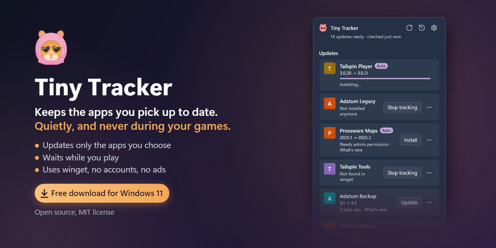
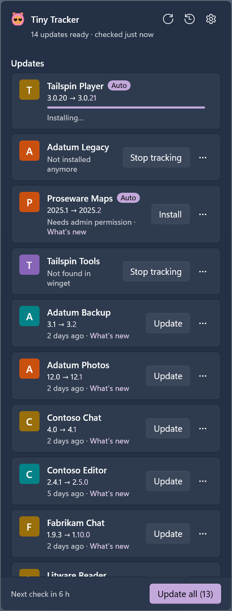
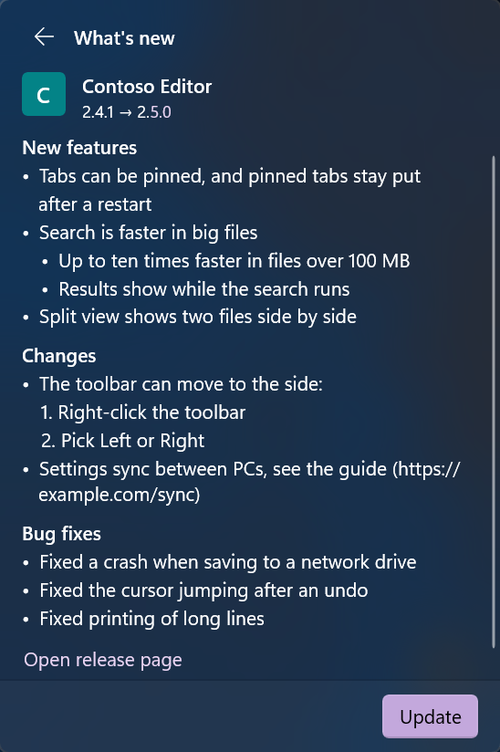
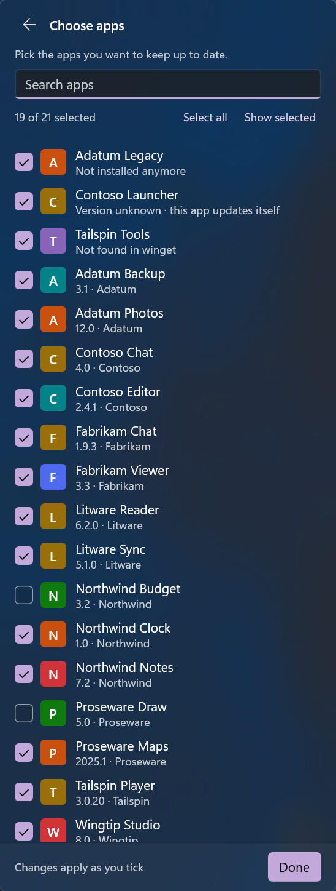
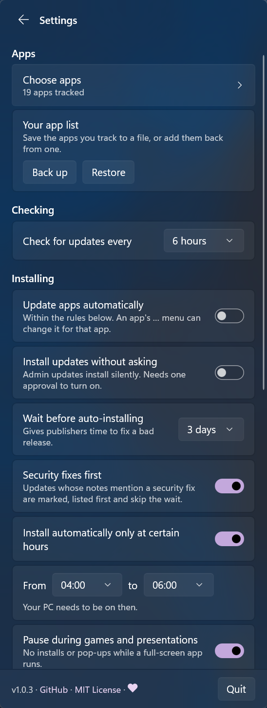
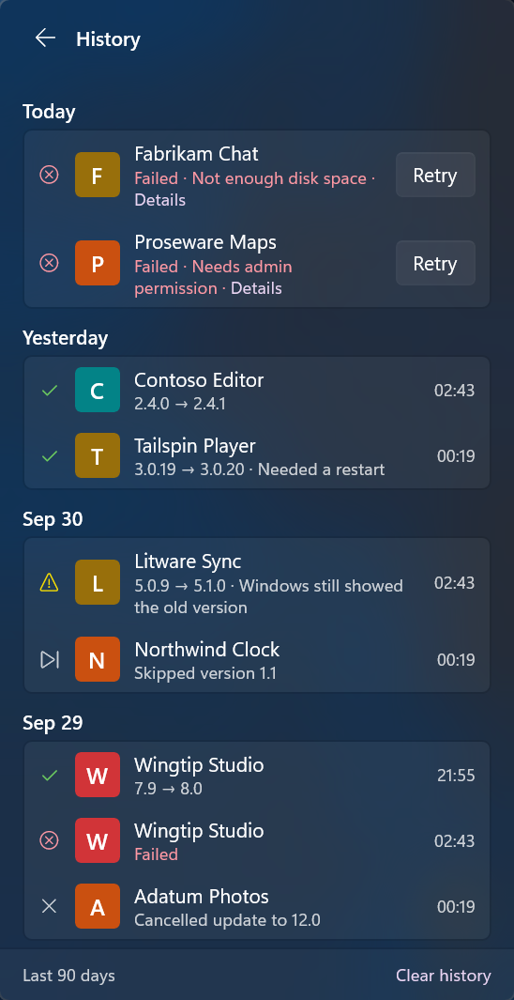

<p align="center">
  <a href="https://github.com/Bikuuuu/tiny-tracker/releases/latest/download/TinyTracker-Setup-x64.exe"></a>
</p>

<h1 align="center">Tiny Tracker</h1>

<p align="center">
  <b>Keeps the apps you pick up to date. Quietly, and never during your games.</b><br>
  A free, open-source tray app for Windows 11, built on winget.
</p>

<p align="center">
  <a href="https://github.com/Bikuuuu/tiny-tracker/releases/latest"></a>
  <a href="https://github.com/Bikuuuu/tiny-tracker/releases/latest/download/TinyTracker-Setup-x64.exe"></a>
  
  <a href="LICENSE"></a>
  <a href="https://github.com/Bikuuuu/tiny-tracker/actions/workflows/ci.yml"></a>
  <a href="https://ko-fi.com/Bikuuuu"></a>
</p>

---

Most apps check for updates only when they start. Keep them out of Windows startup, as many people do for a fast, quiet PC, and their updaters barely run. They fall behind without a word.

Tiny Tracker keeps the apps you pick up to date through winget, the package manager built into Windows. It lives in the notification area, checks every few hours, and waits while you play.

<p align="center">
  
</p>

## What it does

| | |
|---|---|
| **Only your apps** | Updates the apps you pick, with live progress. A click on the hamster, or Win + Shift + U, opens a Windows 11-style flyout. |
| **Auto updates** | One switch for every app, or app by app. Optionally after waiting a few days, or only at the hours you choose. |
| **Never during your games** | Waits during games and presentations, on metered connections and while Energy saver is on. |
| **Security fixes first** | Updates whose notes mention a security fix are marked, come first and skip the wait. |
| **Release notes** | Each update's notes right in the flyout. Skip a version, and see every update in the history. |
| **Close & update** | Offers to close an app that's open and update it, and never closes one without your OK. |
| **Fewer prompts** | Asks for admin permission once per batch, or never, with **Install updates without asking**. |
| **Speed limit** | Can limit the download speed. |
| **Your list, anywhere** | Offers to track an app you install later, and saves your list to a file you can restore on another PC. |
| **Notifications** | As many as you like: all of them, only when you need to act, only failures, or none. |
| **Looks like Windows** | Follows Windows' light or dark mode, accent color, contrast themes and text size. |
| **Updates itself** | From its GitHub releases, when you click Update, or by itself with silent mode on. A download runs only if it matches GitHub's SHA-256 record of the release's file. |

## What it doesn't do

- **It doesn't install or remove software.** It never installs new apps, uninstalls anything or changes an app's settings.
- **It can't update what winget doesn't know.** Such apps show "Not found in winget". When winget can't read an app's version, it shows "Version unknown · this app updates itself".
- **The speed limit doesn't cover everything.** It works through winget's command line, with winget's proxy option, which only lets winget accept a proxy. So turning it on the first time asks for admin permission, unless that option is already on, and on a standard account the switch is greyed out. Web installers that download more by themselves aren't capped.
- **It isn't code-signed.** SmartScreen may warn about the Setup, and Smart App Control blocks it (see [Install](#install)).

## Install

| | |
|---|---|
| **Download** | [TinyTracker-Setup-x64.exe](https://github.com/Bikuuuu/tiny-tracker/releases/latest/download/TinyTracker-Setup-x64.exe): always the latest version, free, about 25 MB |
| **GitHub** | The [latest release](https://github.com/Bikuuuu/tiny-tracker/releases/latest), with the same file as `TinyTracker-Setup-<version>-x64.exe` and its SHA-256 |

You need Windows 11, version 22H2 or later, on a PC with an Intel or AMD processor. winget comes with Windows 11.

1. Run the Setup. Tiny Tracker isn't signed, so SmartScreen may say "Windows protected your PC": choose **More info**, then **Run anyway**. With Smart App Control on, Windows blocks unsigned apps and doesn't offer that choice.
2. Approve Windows' prompt and accept the license. On the last page, leave **Start Tiny Tracker with Windows** and **Launch Tiny Tracker** ticked.
3. The flyout opens on Choose apps. Tick the apps to keep up to date.

For scripts, `TinyTracker-Setup-<version>-x64.exe /VERYSILENT /SUPPRESSMSGBOXES /NORESTART` installs with no pages. A fresh install turns Start with Windows on for the account that runs Setup, and none starts the app.

### Check a download

Each release lists its file's SHA-256. Compare it with yours:

```powershell
Get-FileHash .\TinyTracker-Setup-<version>-x64.exe -Algorithm SHA256
```

Releases are immutable, and GitHub signs a record of each one. With the [GitHub CLI](https://cli.github.com), you can check that your file came from a release:

```powershell
gh release verify-asset v<version> .\TinyTracker-Setup-<version>-x64.exe --repo Bikuuuu/tiny-tracker
```

## Screenshots

<table>
  <tr>
    <td align="center" valign="top"><br><b>What's new</b></td>
    <td align="center" valign="top"><br><b>Choose apps</b></td>
    <td align="center" valign="top"><br><b>Settings</b></td>
    <td align="center" valign="top"><br><b>History</b></td>
  </tr>
</table>

## Everyday use

- Windows keeps new icons under ^ on the taskbar. Drag the hamster out to keep it in view.
- **Quit** is at the bottom of Settings. To start Tiny Tracker again, open it from the Start menu.

## Privacy

- No telemetry, no accounts, no ads.
- It connects only to winget's sources and the apps' own download sites, as winget does, and to GitHub for release dates and its own updates.
- Your settings, history and logs stay in `%APPDATA%\Tiny Tracker`. **Copy diagnostic info** in Settings copies versions, counts and settings only: no app names, paths or user names.

## Uninstall

Open Settings > Apps > Installed apps, and uninstall Tiny Tracker. After Windows' prompt, it asks whether to also remove your settings and history.

For scripts, `"C:\Program Files\Tiny Tracker\unins000.exe" /VERYSILENT /SUPPRESSMSGBOXES /NORESTART` uninstalls with no windows and removes the settings too. Without `/NORESTART`, a silent uninstall restarts the PC when a file is still in use, such as by another account's copy.

What goes:
- the program, its Start menu entry and its entry in Settings > Apps
- silent mode's tasks, for every account
- for you: Start with Windows, the notification registration, the tray icon's entry, winget's proxy option if Tiny Tracker turned it on, and, if you chose so, your settings, history and logs

What can stay:
- Other accounts that used Tiny Tracker on this PC keep their Start with Windows entry (which then starts nothing), notification registration, tray icon entry, settings and history, and winget's proxy option if they turned the limit on: winget keeps it per account.
- Outside Tiny Tracker's control: winget's own logs, what the apps' own installers leave, Windows' records of programs that ran (such as crash reports and the Start menu's tile cache), and the uninstaller's copy in the temp folder, which the next Inno Setup uninstaller removes.

## Build from source

You need Windows 11 x64 and the [.NET 10 SDK](https://dotnet.microsoft.com/download/dotnet/10.0).

```powershell
dotnet build TinyTracker.slnx -c Release
dotnet test TinyTracker.slnx -c Release
```

The installer needs [Inno Setup 7.1](https://jrsoftware.org/isinfo.php): `scripts\build-installer.ps1` writes `dist\TinyTracker-Setup-<version>-x64.exe`. [CONTRIBUTING.md](CONTRIBUTING.md) has more, including a demo mode that installs nothing, and [docs/design.md](docs/design.md) describes how it all works.

## Support Tiny Tracker

Tiny Tracker is free. If it saves you time, you can [support it on Ko-fi](https://ko-fi.com/Bikuuuu).

## License

[MIT](LICENSE). The app includes the .NET runtime, the Windows App SDK (under Microsoft's license terms, shown when you install) and a few other packages; their licenses are in the `licenses` folder next to the app.

## Verified downloads

Only download Tiny Tracker from the [releases](https://github.com/Bikuuuu/tiny-tracker/releases) of this repository. A copy from anywhere else may have been changed by someone else.

Found a security problem? Please see [SECURITY.md](SECURITY.md).
